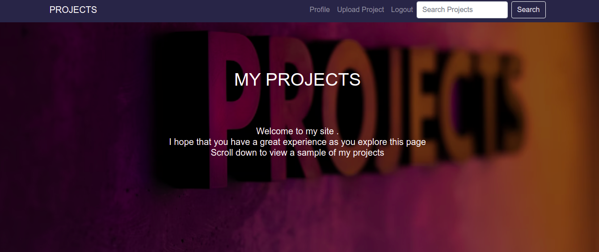
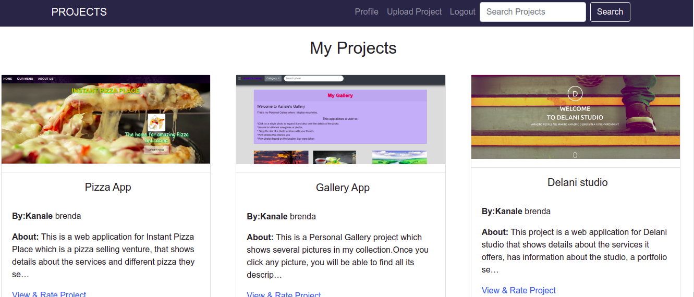

## AWWARDS App
### Author 
Brenda Andeso.

## Description
This Awwards web application serves mainly to enable on to view my projects and rate them. It also enables one to post their own projects after signing up for an account.

## Screenshot

## Setup/Installation Requirements
Install python3.8 Git clone:https://github.com/bre-nda/Awwards. Open terminal command line then navigate to the root folder of the application. cd

## Prerequisites
Create and activate Virtual env then install pip To install django -pip install django LTS Have basic git knowledge

## Technologies Used
* Python3.8 
* Django 3.2.8 
* Bootstrap4 
* CSS 
* HTML

## Contributing
Any contributions you make are greatly appreciated.

If you have a suggestion that would make this better, please fork the repo and create a pull request.

1. Fork the Project 
2. Create your Feature Branch (git checkout -b feature/AmazingFeature) 
3. Commit your Changes (git commit -m 'Add some AmazingFeature') 
4. Push to the Branch (git push origin feature/AmazingFeature) 
5. Open a Pull Request

### User stories
Users would like to:

* View posted projects and their details
* Post a project to be rated/reviewed
* Rate/review other users' projects
* Search for projects
* View projects overall score
* View my profile page

### Support and contact details
For support and contact details;

Call:0743495599 Email at brendaandeso4@gmail.com

### License
(https://github.com/bre-nda/Awwards/blob/master/Licence)

### Copyright
Copyright (c) {2021} Brenda Andeso